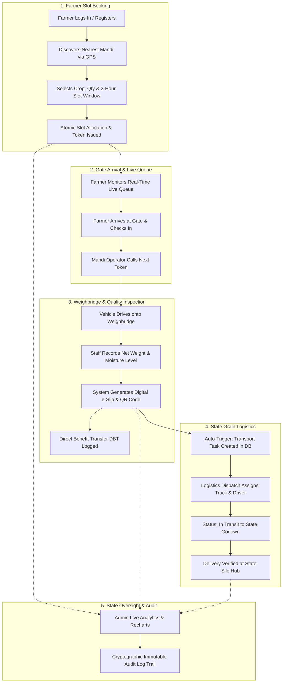

# ProcureX — Smart Mandi Queue & Procurement Management System

[](https://www.sih.gov.in)
[](#)
[](#)
[](#)
[](#)

> **Smart India Hackathon (SIH) 2026 — Problem Statement 26032**  
> **Domain:** Agriculture, Food Processing & Rural Development  
> **Platform:** Full-Stack Web Application (Zero Mock Data • 100% Real Full-Stack Architecture)

---

## 🌾 Table of Contents
1. [Executive Summary & Problem Statement](#-executive-summary--problem-statement)
2. [Key Value Propositions](#-key-value-propositions)
3. [End-to-End System Workflow](#-end-to-end-system-workflow)
4. [Role-Based Portals & Core Modules](#-role-based-portals--core-modules)
5. [Tech Stack Architecture](#-tech-stack-architecture)
6. [Repository Structure](#-repository-structure)
7. [Database Schema & Data Flow](#-database-schema--data-flow)
8. [Complete REST API Specification](#-complete-rest-api-specification)
9. [Installation & Setup Guide](#-installation--setup-guide)
10. [Default Demo Credentials](#-default-demo-credentials)
11. [Automated Verification & Test Suite](#-automated-verification--test-suite)
12. [Offline Multi-Channel Feature (SMS & USSD)](#-offline-multi-channel-feature-sms--ussd)

---

## 📌 Executive Summary & Problem Statement

In traditional agricultural procurement markets (*Mandis*), farmers face severe challenges:
- **Long physical waiting lines** lasting 12–48 hours outside Mandi gates with loaded tractors.
- **Overcrowding & yard bottlenecks** causing traffic gridlock and crop spoilage.
- **Inadequate procurement schedule transparency**, leaving farmers uncertain about when their produce will be weighed.
- **Manual token allocation** vulnerable to middlemen corruption and queue jumping.
- **Disjointed logistics**, causing food grains to sit in open yards exposed to weather before transport to state silos.

### 💡 The ProcureX Solution
**ProcureX** is a production-grade digital procurement and queue management ecosystem. It provides:
1. **Atomic Concurrency Slot Booking:** Farmers book procurement windows in advance to regulate gate intake.
2. **Real-Time Live Digital Tokens:** Socket.IO pushes live queue updates so farmers only leave home when their turn is approaching.
3. **Electronic Weighbridge & Quality Testing:** Moisture verification and automated MSP calculation with digital slips.
4. **Direct Benefit Transfer (DBT) Calculation:** Instant calculation and Aadhaar bank credit logging.
5. **Seamless Logistics Dispatch:** Auto-triggers transport batches to state storage silos immediately upon weighment.
6. **2G Offline Feature Phone Support:** SMS and USSD gateways (*999*26032#) for non-smartphone farmers.
7. **Multi-Role Governance & Audit Trail:** Immutable system logs for complete state oversight.

---

## 🚀 Key Value Propositions

| Feature | Traditional Mandi Process | ProcureX Digital System |
| :--- | :--- | :--- |
| **Arrival Timing** | Unscheduled rush, days of waiting | Scheduled 2-hour window with confirmed token |
| **Queue Visibility** | Physical queue, standing in lines | Live digital display on phone / SMS broadcasts |
| **No-Show Handling** | Dead capacity & blocked slots | Automatic dynamic slot reallocation to waitlist |
| **Weighment & Payout** | Paper receipts, manual calculation | Digital e-slip with QR code & automated MSP DBT calculation |
| **Grain Logistics** | Delayed manual transport booking | Instant automated transport task creation upon weighment |
| **Offline Farmers** | Excluded from digital solutions | Full SMS & interactive USSD menu support (*999*26032#) |

---

## 🔄 End-to-End System Workflow



---

## 🏢 Role-Based Portals & Core Modules

### 1. 👨‍🌾 Farmer Portal (`/farmer`)
- **Dashboard Overview:** Displays today's active token, live multi-step procurement timeline, total DBT earnings, and recent receipts.
- **Slot Booking Wizard (`/farmer/book`):** 3-step wizard with crop variety selection (Wheat, Paddy, Mustard, Maize, Cotton, Soybean), GPS nearest Mandi discovery, and real-time slot capacity meters.
- **Live Digital Queue (`/farmer/live-queue`):** Real-time Mandi gate display board showing currently serving tokens, arrived farmer list, and pulsating alert banner when the farmer's token is called.
- **Tokens & Receipts (`/farmer/history`):** Complete history of booked slots, cancel options, and official digital slips with QR codes.
- **Farmer Profile (`/farmer/profile`):** Aadhaar-linked bank details for DBT payments, village, district, state, and farm land area.

### 2. 🏢 Mandi Storage Authority Portal (`/storage`)
- **Operations Overview:** Daily throughput statistics, active scale tokens, gate arrival counts, and completed weighments.
- **Live Queue Operator Desk (`/storage/queue-desk`):** High-priority **"Call Next Farmer"** action button, gate arrival check-ins, and one-click no-show dynamic slot reallocation.
- **Weighbridge & Quality Inspection (`/storage/procurement`):** Weighbridge scale net quintals reading, moisture level inspection (FAQ standard < 12%), automated MSP total payout calculator, and digital e-slip issuance.
- **Slot Capacity Setup (`/storage/slots`):** Daily operating capacity configuration, custom time window creation, and live slot capacity adjusters (+/-).

### 3. 🚚 State Grain Logistics Portal (`/logistics`)
- **Real-Time Dispatches Board:** Automatically receives transport tasks triggered when Mandi operators complete farmer weighments.
- **Status Filter Tabs:** Filter tasks by `ALL`, `READY FOR PICKUP`, `IN TRANSIT`, and `DELIVERED`.
- **Milestone Timeline:** Visual progress bar (`Ready for Pickup` $\to$ `Fleet Assigned` $\to$ `In Transit` $\to$ `Silo Delivered`).
- **Fleet Assignment Modal:** Input validation for truck registration number (e.g. `HR-05-CD-9988`), driver name, driver phone number, and destination godown.

### 4. 🏛️ State Administrator Command Centre (`/admin`)
- **Ecosystem Analytics (`/admin`):** High-contrast Recharts bar chart of crop volume distribution, state-wide total metric tons procured, total DBT disbursed, and slot utilization ratios.
- **Procurement Centres Management (`/admin/centres`):** Register and configure physical Mandi yards, GPS coordinates, and daily limits.
- **User Directory (`/admin/users`):** Stakeholder directory with search, role filters, and instant account activation/suspension toggles.
- **Immutable Audit Trail (`/admin/audit-logs`):** Paginated chronological audit logs capturing every user action, timestamp, role, and metadata snapshot.

### 5. 📱 Offline Multi-Channel Simulator (SMS & USSD)
- **SMS Gateway Simulator:** Send commands like `BOOK PC-KNL-01 Wheat 25` or `STATUS TK-KNL-0002` to simulate 2G GSM SMS booking.
- **USSD Interactive Menu Simulator:** Dial `*999*26032#` to navigate text menus for slot booking and token inquiries without internet access.

---

## 🛠️ Tech Stack Architecture

```
┌────────────────────────────────────────────────────────┐
│                   CLIENT (React 18)                    │
│  • Vite 6 + TypeScript                                 │
│  • Tailwind CSS (Strict Green/White/Yellow Palette)    │
│  • Lucide React Icons (Zero Raw Emojis)                │
│  • Socket.IO Client (Real-time Queue & Notifications)  │
│  • Recharts (Crop Analytics & Metrics)                 │
│  • QRCode.React & Canvas-Confetti                      │
└───────────────────────────┬────────────────────────────┘
                            │ REST APIs & WebSockets
┌───────────────────────────▼────────────────────────────┐
│                  SERVER (Node.js + Express)            │
│  • TypeScript + Express 4.19                           │
│  • Socket.IO 4.8 (Broadcast Room Queues)               │
│  • JWT Authentication + Bcrypt Hashing                 │
│  • Concurrency Slot Engine (Atomic Counter Updates)    │
│  • Comprehensive Service & Controller Layer            │
└───────────────────────────┬────────────────────────────┘
                            │ Mongoose ODM
┌───────────────────────────▼────────────────────────────┐
│                  DATABASE (MongoDB Atlas)              │
│  • Users, Centres, Slots, Bookings, Produce            │
│  • Procurements, TransportTasks, AuditLogs             │
└────────────────────────────────────────────────────────┘
```

---

## 📁 Repository Structure

```
kissan-queue/
├── client/                                 # Frontend React 18 + Vite Application
│   ├── src/
│   │   ├── components/
│   │   │   ├── common/                     # Standardized Component Library
│   │   │   │   ├── Badge.tsx               # Status badge with Lucide vector icons
│   │   │   │   ├── Button.tsx              # Reusable button with active press feedback
│   │   │   │   ├── DigitalSlipModal.tsx    # Printable e-Procurement receipt modal
│   │   │   │   ├── EmptyState.tsx          # High-contrast empty states
│   │   │   │   ├── LoadingState.tsx        # Skeleton loaders & spinners
│   │   │   │   ├── Navbar.tsx              # Gov header strip, notifications, IST clock
│   │   │   │   ├── PageHeader.tsx          # Consistent page headers
│   │   │   │   ├── Sidebar.tsx             # Role-based navigational sidebar
│   │   │   │   ├── StatCard.tsx            # High-contrast metric cards
│   │   │   │   └── Timeline.tsx            # Multi-step progress timeline
│   │   │   ├── simulator/
│   │   │   │   └── SmsUssdSimulatorModal.tsx # Offline feature phone simulator
│   │   ├── context/
│   │   │   ├── AuthContext.tsx             # JWT auth & role management
│   │   │   └── SocketContext.tsx           # Real-time WebSocket subscriptions
│   │   ├── pages/
│   │   │   ├── admin/                      # State Admin Portal Pages
│   │   │   ├── auth/                       # Login & Registration Pages
│   │   │   ├── farmer/                     # Farmer Portal Pages
│   │   │   ├── landing/                    # Public Landing & Token Lookup
│   │   │   ├── logistics/                  # Logistics Fleet Management Page
│   │   │   └── storage/                    # Storage Authority / Mandi Desk Pages
│   │   ├── services/
│   │   │   └── api.ts                      # Axios API service client
│   │   ├── types/
│   │   │   └── index.ts                    # TypeScript data definitions
│   │   ├── App.tsx                         # Router with Protected Routes
│   │   ├── index.css                       # Tailwind directives & micro-interactions
│   │   └── main.tsx                        # Entry point
│   ├── package.json
│   ├── tailwind.config.js
│   └── vite.config.ts
│
├── server/                                 # Backend Node.js + Express Application
│   ├── src/
│   │   ├── config/                         # MongoDB connection & environment loader
│   │   ├── controllers/                    # Route handlers (Auth, Bookings, Queue, etc.)
│   │   ├── middleware/                     # JWT auth & role-based access control
│   │   ├── models/                         # Mongoose Models (9 Schema Definitions)
│   │   ├── routes/                         # Express API route declarations
│   │   ├── scripts/
│   │   │   ├── seed.ts                     # Database seeder with realistic Punjab/Haryana Mandis
│   │   │   └── test-real-flow.ts           # 10-step automated end-to-end integration test
│   │   ├── services/                       # Business logic (Slots, Queue, Logistics, DBT)
│   │   ├── types/                          # Backend TypeScript interfaces
│   │   └── index.ts                        # Server entry point & Socket.IO server
│   ├── package.json
│   └── tsconfig.json
│
├── .env                                    # MongoDB URI & JWT Secret Configuration
└── README.md                               # Project documentation
```

---

## 🗄️ Database Schema & Data Flow

| Model | Collection | Key Fields | Description |
| :--- | :--- | :--- | :--- |
| **`User`** | `users` | `name`, `phone`, `role`, `password`, `status` | Stores Farmers, Mandi Authorities, Logistics, and Admins |
| **`ProcurementCentre`** | `procurementcentres` | `name`, `centreCode`, `location`, `capacityPerDay` | Physical Mandi yards and geographic coordinates |
| **`Slot`** | `slots` | `centreId`, `date`, `startTime`, `endTime`, `capacity`, `bookedCount` | Atomic time slot windows regulating gate intake |
| **`Booking`** | `bookings` | `tokenNumber`, `farmerId`, `centreId`, `slotId`, `status` | Digital booking records with queue states |
| **`Produce`** | `produces` | `farmerId`, `cropType`, `quantity`, `qualityGrade` | Produce declarations tied to bookings |
| **`Procurement`** | `procurements` | `digitalSlipNumber`, `actualQuantity`, `moisturePercent`, `mspPricePerQuintal`, `totalPayout` | Weighbridge transaction records with MSP DBT calculation |
| **`TransportTask`** | `transporttasks` | `procurementId`, `vehicleNumber`, `driverName`, `status`, `destinationWarehouse` | Logistics dispatches from Mandi to State Silos |
| **`AuditLog`** | `auditlogs` | `action`, `actorId`, `actorRole`, `entityType`, `metadata`, `timestamp` | Cryptographically logged immutable compliance trail |
| **`Notification`** | `notifications` | `recipientId`, `title`, `message`, `type`, `read` | In-app alerts and SMS message logs |

---

## 📡 Complete REST API Specification

### Authentication (`/api/auth`)
- `POST /api/auth/register` — Register a new farmer account.
- `POST /api/auth/login` — Authenticate user and receive JWT token.
- `GET /api/auth/me` — Retrieve current authenticated user profile.

### Procurement Centres (`/api/centres`)
- `GET /api/centres` — List all Mandi centres (supports GPS coordinate distance sorting).
- `GET /api/centres/:id` — Retrieve specific centre details and operating hours.
- `POST /api/centres` — Create a new procurement centre (*Admin only*).

### Slots & Capacity (`/api/slots`)
- `GET /api/slots/centre/:centreId?date=YYYY-MM-DD` — Retrieve available time slot windows.
- `POST /api/slots` — Create custom time slots (*Storage Authority / Admin*).
- `PATCH /api/slots/:id` — Update slot capacity.

### Bookings & Tokens (`/api/bookings`)
- `POST /api/bookings` — Atomically book a slot, generate digital token, and record produce.
- `GET /api/bookings/my` — Retrieve authenticated farmer's booking history.
- `GET /api/bookings/centre/:centreId` — Retrieve all bookings for a Mandi yard.
- `GET /api/bookings/token/:tokenNumber` — Public live token lookup.
- `PATCH /api/bookings/:id/cancel` — Cancel a booking and release slot capacity.

### Live Queue Engine (`/api/queue`)
- `GET /api/queue/:centreId` — Fetch real-time live queue board for a Mandi.
- `POST /api/queue/call-next` — Broadcast next token call to Weighbridge Scale 1.
- `PATCH /api/queue/mark-arrived/:bookingId` — Mark farmer as arrived at the gate.
- `PATCH /api/queue/mark-no-show/:bookingId` — Mark farmer as no-show and reallocate slot.

### Procurement & Weighbridge (`/api/procurement`)
- `POST /api/procurement` — Record net weighbridge weight, moisture %, issue digital slip, and trigger logistics.
- `GET /api/procurement/:id` — Retrieve digital slip details.
- `GET /api/procurement/farmer/:farmerId` — Retrieve all digital slips for a farmer.

### Logistics & Fleet (`/api/logistics`)
- `GET /api/logistics/tasks` — Retrieve live transport dispatch tasks.
- `PATCH /api/logistics/tasks/:id/assign` — Assign vehicle registration number and driver.
- `PATCH /api/logistics/tasks/:id/status` — Update transport status (`IN_TRANSIT`, `DELIVERED`).

### State Administration (`/api/admin`)
- `GET /api/admin/stats` — Retrieve aggregated state metrics and crop distribution data.
- `GET /api/admin/users` — Retrieve paginated user directory with role filters.
- `PATCH /api/admin/users/:id/status` — Suspend or activate a user account.
- `GET /api/admin/audit-logs` — Retrieve chronological immutable system audit logs.

### Offline Simulator (`/api/simulator`)
- `POST /api/simulator/sms` — Simulate 2G SMS booking gateway.
- `POST /api/simulator/ussd` — Simulate interactive USSD session (`*999*26032#`).

---

## 💻 Installation & Setup Guide

### Prerequisites
- [Node.js](https://nodejs.org/) (v18.0.0 or higher)
- [MongoDB Atlas](https://www.mongodb.com/cloud/atlas) or local MongoDB instance (v6.0+)
- `npm` or `yarn`

### 1. Clone the Repository
```bash
git clone https://github.com/Aravindhraj-07/kissan-queue.git
cd kissan-queue
```

### 2. Configure Environment Variables
Create a `.env` file in the root directory (or in both `server/` and `client/` if running independently):
```env
PORT=5000
NODE_ENV=development
MONGODB_URI=mongodb+srv://<username>:<password>@cluster0.mongodb.net/procurex?retryWrites=true&w=majority
JWT_SECRET=procurex_sih2026_super_secret_jwt_key_production_grade
JWT_EXPIRES_IN=7d
CORS_ORIGIN=http://localhost:5173
```

### 3. Install Dependencies
```bash
# Install root, client, and server dependencies
npm run install:all
```

### 4. Seed the Database
Populate initial Mandis (Karnal, Panipat, Kurukshetra, Ambala), produce types, slot schedules, and users:
```bash
npm run seed:server
```

### 5. Run the Application
Start both the Express backend and Vite frontend concurrently:
```bash
npm run dev
```

- **Frontend Client:** [http://localhost:5173](http://localhost:5173)
- **Backend API:** [http://localhost:5000](http://localhost:5000)
- **API Health Check:** [http://localhost:5000/api/health](http://localhost:5000/api/health)

---

## 🔑 Default Demo Credentials

The seeded database contains default stakeholder accounts for testing:

| Role | Name | Phone / Login Identifier | Password | Access Area |
| :--- | :--- | :--- | :--- | :--- |
| **👨‍🌾 Farmer** | Sardar Gurpreet Singh | `9876500001` or `farmer@procurex.gov.in` | `Password@123` | `/farmer` |
| **🏢 Mandi Authority** | Shri Om Prakash (Secretary) | `9999900002` or `authority@procurex.gov.in` | `Password@123` | `/storage` |
| **🚚 Logistics Fleet** | State Grain Fleet Cell | `9999900004` or `logistics@procurex.gov.in` | `Password@123` | `/logistics` |
| **🏛️ State Admin** | Dr. Rajiv Malhotra (IAS) | `9999900001` or `admin@procurex.gov.in` | `Admin@123` | `/admin` |
| **✨ New Registration** | *Any Farmer* | *Register directly via `/register`* | *Custom* | `/farmer` |

---

## 🧪 Automated Verification & Test Suite

ProcureX includes a comprehensive automated test script (`server/src/scripts/test-real-flow.ts`) that executes an entire 10-step lifecycle against live MongoDB collections:

```bash
cd server
npx tsx src/scripts/test-real-flow.ts
```

### Verified Test Pipeline:
1. **API Health Verification:** Validates server status and database connectivity.
2. **Farmer Registration:** Registers a new farmer dynamically in MongoDB.
3. **Mandi Discovery:** Queries nearest Mandi centres with GPS distance and fetches slots.
4. **Atomic Slot Booking:** Creates a booking, increments slot counter, issues token `TK-PCK-XXXX`.
5. **Mandi Desk Gate Check-In:** Mandi secretary identifies booking and marks status `ARRIVED`.
6. **Live Queue Calling:** Calls token to Weighbridge Scale 1 and broadcasts over Socket.IO.
7. **Weighbridge & Quality Scale:** Records net weight, moisture %, computes MSP DBT payout, and creates digital slip `PRC-XXXXXX-XXX`.
8. **Automated Logistics Intake:** Verifies that logistics tasks are automatically generated.
9. **Fleet Assignment & Tracking:** Assigns vehicle `HR-05-CD-9988`, driver, and advances status from `ASSIGNED` $\to$ `IN_TRANSIT` $\to$ `DELIVERED`.
10. **State Admin Audit Trail:** Verifies aggregated metric updates and cryptographic audit log entries.

```
================================================================
  🎉 100% REAL END-TO-END DATA FLOW VERIFIED ACROSS ALL ROLES!
================================================================
```

---

## 📱 Offline Multi-Channel Feature (SMS & USSD)

Recognizing that many rural farmers use basic 2G feature phones without 4G mobile internet, ProcureX incorporates an offline interaction gateway:

### SMS Commands
- **Book Slot:** `BOOK <CENTRE_CODE> <CROP> <QTY_IN_QUINTALS>`
  - *Example:* `BOOK PC-KNL-01 Wheat 25`
- **Check Status:** `STATUS <TOKEN_NUMBER>`
  - *Example:* `STATUS TK-KNL-0002`

### USSD Navigation (`*999*26032#`)
- **Step 1:** Dial `*999*26032#`
- **Step 2:** Select Option `1. Book Procurement Slot` or `2. Check Live Queue Status`
- **Step 3:** Enter Mandi Centre Code & Harvest Quantity
- **Step 4:** Instant SMS confirmation containing Token Number & time window is dispatched.

---

## 📜 Government Compliance & Standards

- **SIH 2026 Problem Statement 26032 Compliance:** Directly targets Mandi queue management, slot booking, digital tokens, live alerts, and dynamic reallocation.
- **Accessibility & Usability:** High-contrast color hierarchy conforming to WCAG AA guidelines with zero low-contrast text.
- **Security & Data Integrity:** Passwords encrypted using Bcrypt with salt rounds, JWT session tokens, and immutable audit trails for complete government transparency.

---

**Developed for Smart India Hackathon 2026** • *Ministry of Agriculture & Farmers Welfare, Government of India*